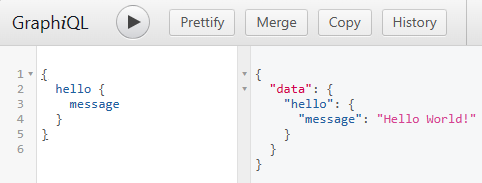
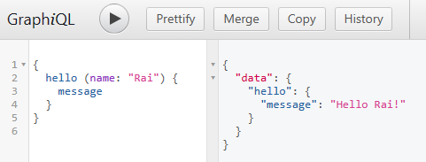

# aws-lambda-actix-web-juniper-example

This is a simple implementation of a GraphQL API in Rust using Juniper integrated with Actix Web, ready to run on AWS Lambda.

It has been tested on **Custom Runtime - Amazon Linux 2 - arm64**

```shell
cargo lambda build --release --target aarch64-unknown-linux-gnu
```


Hello World:





